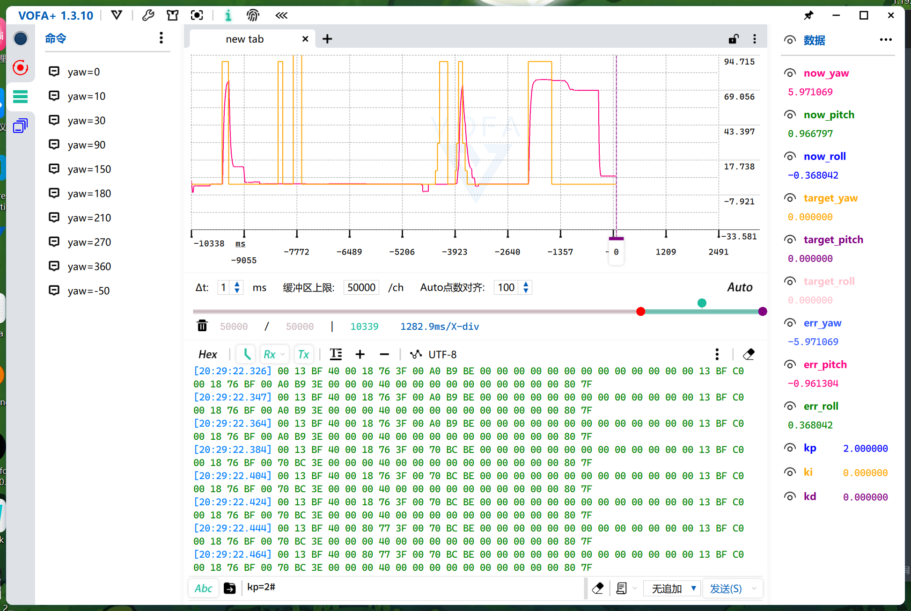

# 					云台控制


硬件：
达妙DM-J4310-2EC电机，达妙H7开发板，JY61P模块

功能：最终要实现云台自稳定
## 项目简介介绍

```tex
jump-cat-test_from_flower/
│
├── App/                          # 应用程序层
├── Core/                         # 核心驱动层 (HAL/LL)
├── Drivers/                      # 官方驱动库
├── Middlewares/                  # 中间件 (FreeRTOS, USB等)
├── USB_DEVICE/                   # USB设备相关
├── User_Config/                  # 用户配置文件
├── User_File/                    # 用户应用代码 (核心工作区)
│   │
│   ├── 1_Middleware/             # 中间件封装层
│   │   └── (算法库、通信协议等)
│   │
│   ├── 2_Device/                 # 设备驱动层
│   │   ├── dvc_jy61p.cpp/h       # JY61P姿态传感器驱动
│   │   ├── dvc_vofa.cpp/h        # VOFA上位机协议驱动
│   │   └── (电机驱动、WS2812等)
│   │
│   └── 4_Task/                   # FreeRTOS任务层 (你主要工作目录)
│       │
│       ├── ws2812_task.cpp/h     # RGB指示灯任务 (优先级最低)
│       │
│       ├── jy61p_task.cpp/h      # JY61P姿态采集任务
│       │   ├── 读取IMU数据
│       │   ├── 解析四元数/欧拉角
│       │   └── 提供 Get_Current_Yaw/Pitch/Roll() 接口
│       │
│       ├── motor_dm_task.cpp/h   # 达妙电机通信任务
│       │   ├── CAN/串口通信
│       │   ├── MIT模式指令封装
│       │   └── 提供 Motor_DM_Set_Speed() 接口
│       │
│       ├── vofa_task.cpp/h       # VOFA上位机调试任务 (已改造)
│       │   ├── 50Hz发送IMU数据到上位机
│       │   ├── 解析命令: yaw=90#, pitch=30#, roll=15#
│       │   ├── 调用 Set_Target_Yaw/Pitch/Roll() 接口
│       │   └── 保留 q00/r00 等调试命令
│       │
│       ├── set_angle_test_task.cpp/h # 设定角度测试任务 (核心控制)
│       │   ├── 接收VOFA传来的目标角度
│       │   ├── 读取JY61P当前角度
│       │   ├── PID计算: 角度误差 → 目标速度 (rad/s)
│       │   ├── 处理偏航轴±180°环绕
│       │   └── 调用 Motor_DM_Set_Speed() 执行
│       │
│       ├── balance_test_task.cpp/h # 平衡测试任务 (备选/废弃)
│       └── control_task.cpp/h      # 早期控制任务 (已废弃)
│
├── CMakeLists.txt               # CMake构建配置
├── H7_test.ioc                  # STM32CubeMX配置
├── startup_stm32h723xx.s        # 启动文件
└── README.md                    # 项目说明
```

## 云台思路

```tex
VOFA发送 yaw=90°
      ↓
set_angle_test_task 接收目标角度
      ↓
读取 JY61P 当前角度 (如当前30°)
      ↓
计算角度误差 = 90° - 30° = 60°
      ↓
PID控制器: 误差60° → 目标速度 (rad/s)
      ↓
motor_dm_task: MIT模式控制电机转动
      ↓
云台转动，JY61P实时反馈
      ↓
角度误差逐渐减小 → 速度逐渐降低
      ↓
到达90° → 误差为0 → 停止

```


|    `yaw=数值#`    | **设定目标偏航角** | **例如 `yaw=90#` 让云台转到90度方向**                      |
| :---------------: | :----------------: | ---------------------------------------------------------- |
| **`pitch=数值#`** | **设定目标俯仰角** | **例如 `pitch=30#` 让云台上仰30度**                        |
| **`roll=数值#`**  | **设定目标横滚角** | **例如 `roll=15#` 让云台侧倾15度**                         |
|  **`kp=数值#`**   |    **设定kp值**    | **例如 `kp=1.0#` 让角度误差转换成目标速度的kp参数设为1.0** |
|  **`ki=数值#`**   |    **设定ki值**    | **例如 `ki=2.8#` 让角度误差转换成目标速度的ki参数设为2.8** |
|  **`kd=数值#`**   |    **设定kd值**    | **例如 `kp=3.5#` 让角度误差转换成目标速度的kd参数设为3.5** |


现在就可以使用**VOFA在线调节参数**，不需要手动一遍一遍的修改再烧录了


